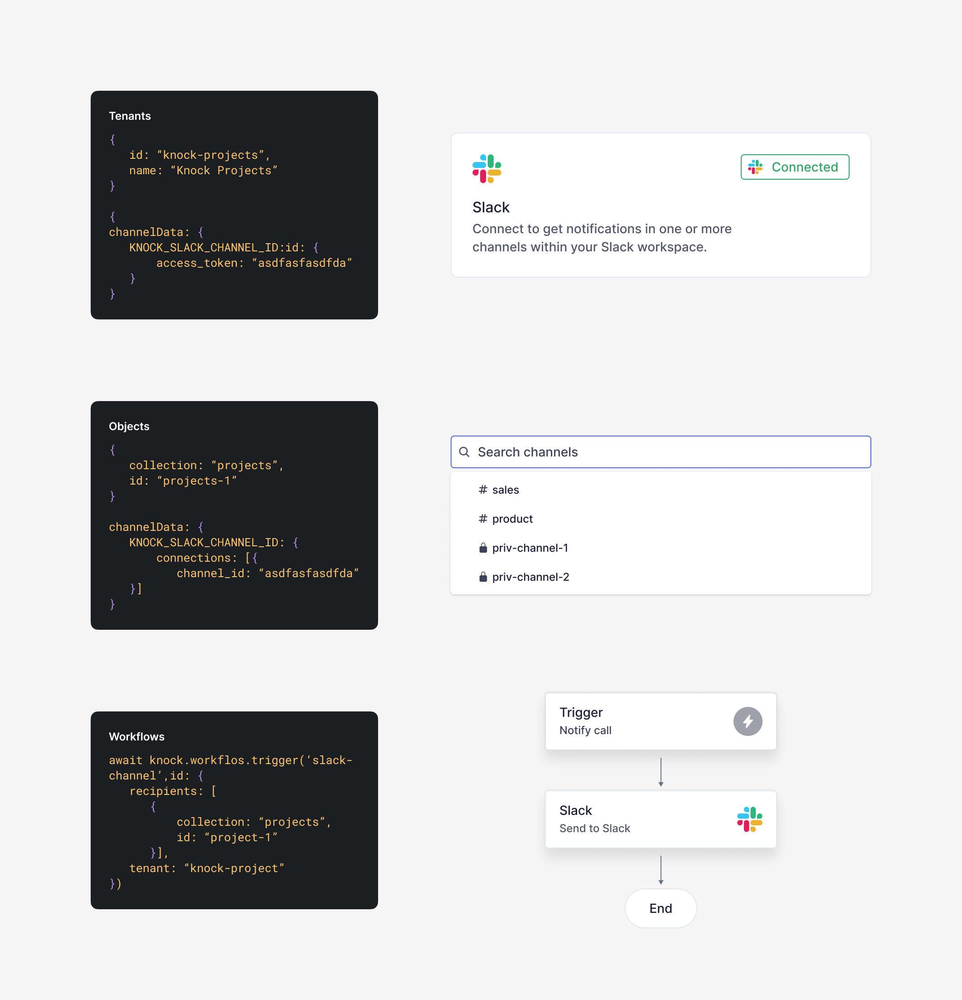
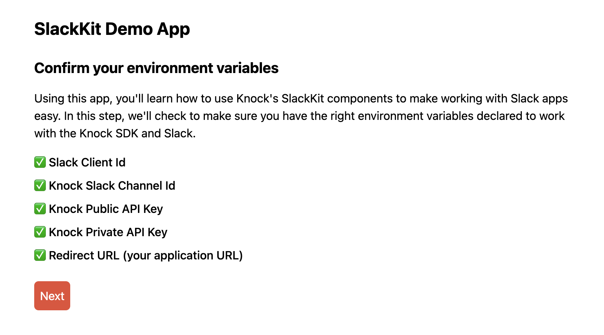
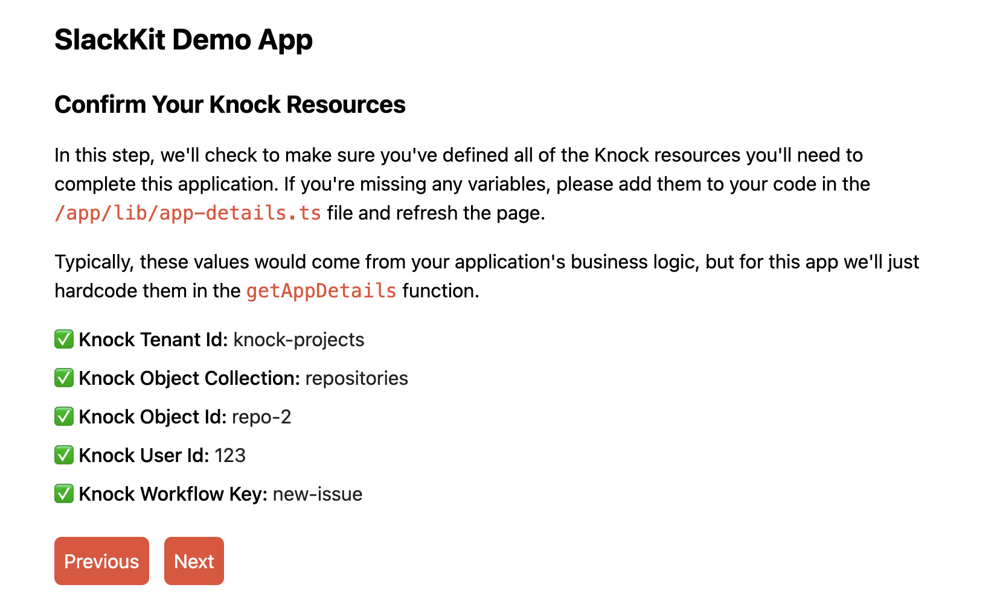
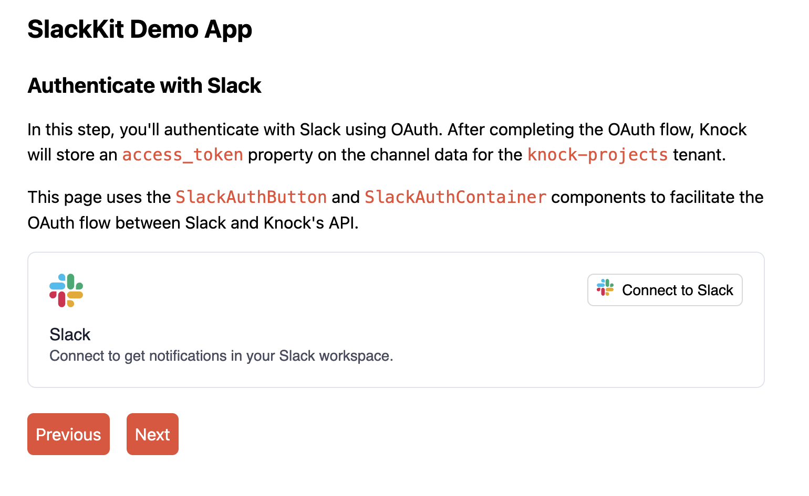
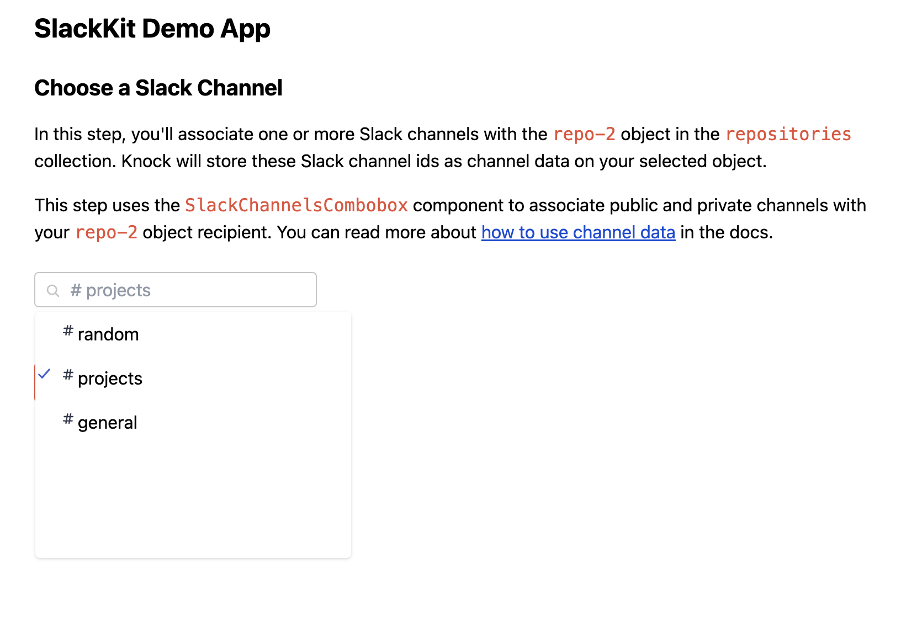
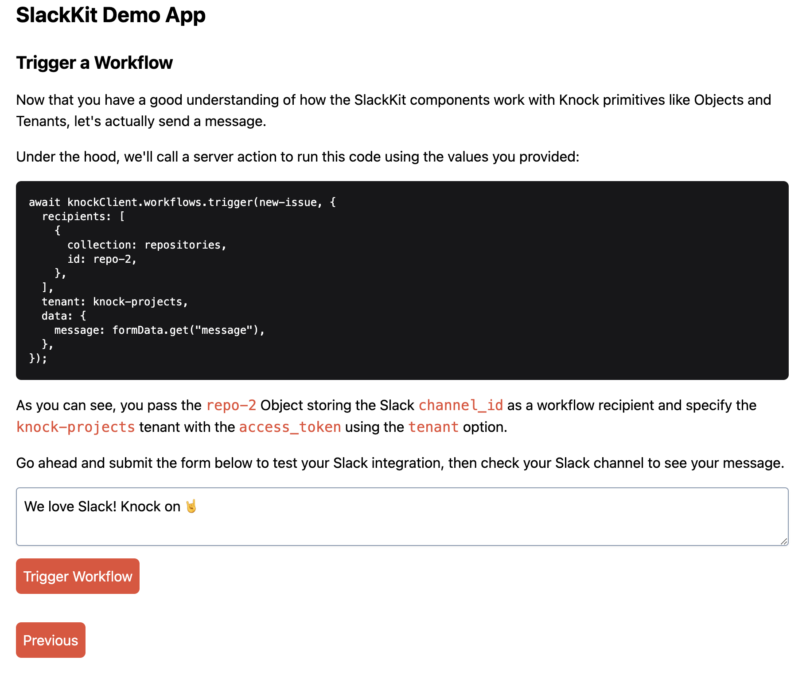

SlackKit is a collection of embeddable UI components and APIs that radically simplifies the process of adding a Slack integration to a SaaS product. This is an example app meant to help you get started using the SlackKit components and APIs provided by Knock.



## Getting started

For this project, there are quite a few configuration variables you need before you can get started. Some of these are typical environment variables you would supply to your application, like API keys, tokens, or client ids.

The other set of values would typically be determined by your product's business logic, but you can hardcode these values for the time being.

### Setting up a Slack app

You can either follow the setup steps outlined here, or use the official instruction in the [SlackKit docs](https://docs.knock.app/integrations/chat/slack-kit/setup).

#### Create a new app

First, visit https://api.slack.com/apps and sign into your account. Then click `Create new app` and select the `From scratch` option. Next, select which workspace to develop it in. You'll still be able to use it in other workspaces, so this selection isn't critical.

#### Add bot features

Under `Add features and functionality` select `Bots` features. Then, under `OAuth and Permissions`, give it the `channels:read` scope. It doesn’t really need any scopes here since we’ll be sending the scopes we need from the component, but we need to do this so we can expose the redirect url form.

#### Add redirect URL

Also under `OAuth and Permissions`, find the redirect URL section and add this Knock URL to that field: https://api.knock.app/providers/slack/authenticate. Knock's API endpoint will handle the OAuth callback for you and store a Slack access token. Finally, Under `Manage distribution`, allow it to be publicly distributed

### Setting up Knock

For this tutorial, you'll need a Knock account. If you don't already have one, you can [sign up on this page](https://dashboard.knock.app/signup). You can also find these steps outlined in the official [SlackKit docs](https://docs.knock.app/integrations/chat/slack-kit/setup#add-slack-app-to-knock-slack-channel).

#### Create a Slack channel

Add [a Slack channel in Knock](https://docs.knock.app/concepts/channels#channel-settings) with the `Client Id` and `Client Secret` from the `Basic Info` section of your Slack. Take note of this channel id for use in the next step.

#### Create a new workflow

Create a new [workflow](https://docs.knock.app/concepts/workflows) with a [Slack channel step](https://docs.knock.app/designing-workflows/channel-step) pointing to this Slack channel. Take note of this workflow key for use in the following steps. In the [message template](https://docs.knock.app/designing-workflows/template-editor/overview) use the following liquid tag to test your ability to send messages: `A new issue was submitted: {{message}}`

### Environment variables

All of these values are sourced from environment variables at runtime. The example app will check for these values as the first step. Make a copy of `.env.sample` using the following command: `cp .env.sample .env.local`

| Env Var                            | Description                                                                                                                                                                                                                                                                                   |
| ---------------------------------- | --------------------------------------------------------------------------------------------------------------------------------------------------------------------------------------------------------------------------------------------------------------------------------------------- |
| NEXT_PUBLIC_KNOCK_SLACK_CHANNEL_ID | This value comes from Knock after you create a Slack channel in the dashboard.                                                                                                                                                                                                                |
| NEXT_PUBLIC_SLACK_CLIENT_ID        | This value comes from Slack when you create a new Slack app. You can find it in your app's 'Basic Info' section.                                                                                                                                                                              |
| KNOCK_SIGNING_KEY                  | This value comes from Knock and is used to sign a JWT on behalf of a user to store channel data for Slack tokens and channel ids. You can generate a signing key under "Developers" > "API keys." Use the PEM encoded version. **This is a secret value and should not be exposed publicly.** |
| KNOCK_API_KEY                      | This value comes from Knock and is used to authenticate server-side API requests. You can find it listed as the secret key under "Developers" > "API keys." **This is a secret value and should not be exposed publicly.**                                                                    |
| NEXT_PUBLIC_KNOCK_CLIENT_ID        | This value comes from Knock and is used to authenticate public API requests from the browser. You can find it listed as the public key under "Developers" > "API keys."                                                                                                                       |
| NEXT_PUBLIC_KNOCK_API_URL          | This value comes from Knock and is used to construct the URL for API endpoints. You can keep the default value for this.                                                                                                                                                                      |
| NEXT_PUBLIC_REDIRECT_URL           | This value comes from your application. It is where Knock will redirect your user after the OAuth flow with Slack. The default of `http://localhost:3000` is valid when running this project locally.                                                                                         |

### Knock resource variables

To make the connection between Slack channels and Knock objects, you'll also need to provide details for several types of resources in Knock. To do this, you can replace the values in the `getAppDetails` function inside of the `/app/lib/app-details.ts` file. These values would typically be determined by your application's business logic, but we can hardcode them for this example:

```
export function getAppDetails() {
  return {
    tenant: "knock-projects",
    collection: "repositories",
    objectId: "repo-2",
    userId: "123",
    workflowKey: "new-issue",
  };
}
```

You should already have a value for `workflowKey` from a previous step, and you can choose a [user identifier](https://docs.knock.app/concepts/users#user-identifiers) to use from the dashboard.

#### Create a tenant

In SlackKit, [tenants](https://docs.knock.app/concepts/tenants) are used to store the access token for an organization's Slack workspace. You can create a new tenant from the dashboard and include it's ID as the value for the `tenant` property in the `getAppDetails` function. You can also use this cURL command to create a tenant by replacing the values for `tenant-id`, `KNOCK_API_KEY`, and `tenant-name`:

```
curl --location --request PUT 'https://api.knock.app/v1/tenants/<tenant-id>' \
--header 'Content-Type: application/json' \
--header 'Authorization: Bearer <KNOCK_API_KEY>' \
--data '{
  "name": "<tenant-name>",
}'
```

#### Create an object

In SlackKit, [objects](https://docs.knock.app/concepts/objects) are used to store channels and act as the recipient of your workflows. You can't create a new object from the dashboard, so you can use this cURL command to create an object by replacing the values for `object-collection`, `object-id`, `KNOCK_API_KEY`, and `object-name`:

```
curl --location --request PUT 'https://api.knock.app/v1/objects/<object-collection>/<object-id>' \
--header 'Content-Type: application/json' \
--header 'Authorization: Bearer <KNOCK_API_KEY>' \
--data '{
    "name": "<object-name>"
}'
```

Once you've done that, update the values in the `getAppDetails` function to point to your new object.

## Running the app locally

Now that you have all of the configuration out of the way, you can install your dependencies using one of the following commands:

```
npm install
//or
yarn install
```

After your dependencies have installed, you can run the app in dev mode:

```
npm run dev
//or
yarn dev
```

If you open the app in a browser at `http://localhost:3000` you should see a screen that looks like this:



This step gives you an opportunity to confirm that you have all of the necessary environment variables needed to use the application.

If you click `Next` you'll navigate to a screen where you can confirm the Knock resources you'll use to connect your Slack app:



If all of the values in this step look good, you can click `Next` to authenticate with your Slack app and store the `access_token` in Knock.

## Sharing Knock and Slack state

Before we dig into the actual SlackKit UI components and their functionality, let's look at how we share certain values across those components in our application.

In the `@knocklabs/react` package, Knock already exposes a `KnockProvider` component that is meant to provide top-level authentication and authorization to components farther down in the component tree.

With the SlackKit release, the `@knocklabs/react` package now also contains a Slack-specific provider, called `KnockSlackProvider`. Since these both rely on React context, they are implemented as client-side components in `/app/components/providers.tsx` in the following manner:

```
"use client";

import { KnockProvider, KnockSlackProvider } from "@knocklabs/react";

export default function Providers({
  userToken,
  knockUserId,
  tenant,
  children,
}: {
  userToken: string;
  knockUserId: string;
  tenant: string;
  children: JSX.Element;
}) {
  return (
    <>
      <KnockProvider
        apiKey={process.env.NEXT_PUBLIC_KNOCK_CLIENT_ID!}
        userId={knockUserId}
        host={process.env.NEXT_PUBLIC_KNOCK_API_URL}
        userToken={userToken}
      >
        {/*
        The KnockProvider handles authentication with Knock, while the KnockSlackProvider
        provides shared context to all Slack-related components.
        Both are required for Slack-related apps.
        */}
        <KnockSlackProvider
          knockSlackChannelId={process.env.NEXT_PUBLIC_KNOCK_SLACK_CHANNEL_ID!}
          tenant={tenant}
        >
          {children}
        </KnockSlackProvider>
      </KnockProvider>
    </>
  );
}
```

To create some of the necessary authentication data, like `userToken` and `userId`, we implement the `Providers` component inside of the root `layout.tsx` file. In this code, which runs on the server, we also add some additional grants to the `userToken` JWT to allow the user to interact with the Slack resources stored in Knock. You can read more about these [resource access grants in the docs](https://docs.knock.app/integrations/chat/slack-kit/resource-access-grants).

**Note: this is necessary because the user in this context is an end user in your application who does not have access to Knock as a [member of the account](https://docs.knock.app/manage-your-account/managing-members). Therefore, these grants provide them elevated privileges to operate on specific resources using the API.**

```
import { Knock } from "@knocklabs/node";
import { Grants } from "@knocklabs/node/dist/src/common/userTokens";
import "@knocklabs/react/dist/index.css";

import Providers from "./components/providers";
import "./global.css";
import { getAppDetails } from "./lib/app-details";

const { userId, tenant, collection, objectId } = getAppDetails();

const signingKey = process.env.KNOCK_SIGNING_KEY!;

async function MyApp({ children }: { children: React.ReactElement }) {

	const userToken = signingKey
		? await Knock.signUserToken(userId, {
				grants: [
					Knock.buildUserTokenGrant({ type: "tenant", id: tenant }, [
						Grants.SlackChannelsRead,
					]),
					Knock.buildUserTokenGrant(
						{ type: "object", id: objectId, collection: collection },
						[Grants.ChannelDataRead, Grants.ChannelDataWrite],
					),
				],
			})
		: "secretOrPrivateKey";

	return (
		<>
			<html>
				<body className="px-12 py-6">
					<h1 className="text-2xl font-bold mb-6">SlackKit Demo App</h1>
					<Providers userToken={userToken} knockUserId={userId} tenant={tenant}>
						{children}
					</Providers>
				</body>
			</html>
		</>
	);
}

export default MyApp;
```

## Authenticating with Slack

On this screen, you can initiate the OAuth flow with Slack. This page uses two SlackKit components to help facilitate this interaction: `SlackAuthButton` and `SlackAuthContainer`.



Both of these components are client-side components. The `SlackAuthButton` component takes your `redirectUrl` and `slackClientId` as props:

```
<SlackAuthContainer
    actionButton={
        <SlackAuthButton
        slackClientId={process.env.NEXT_PUBLIC_SLACK_CLIENT_ID!}
        redirectUrl={process.env.NEXT_PUBLIC_REDIRECT_URL}
        />
    }
/>
```

When this button is clicked, it will initiate an OAuth flow in a pop-up window where the user can authenticate with Slack and choose a workspace to install the app. Once the flow is complete, the pop-up window should close and the state of the component should update to show it is `Connected` to Slack. Behind the scenes, Knock handles the OAuth callback from Slack and stores an `access_token` on the `tenant` you provided to the `KnockSlackProvider` as [channel data](https://docs.knock.app/managing-recipients/setting-channel-data).

**Note: if the pop-up window does not close, double check that the `redirectUrl` matches your current environment.**

From here, you can click `Next` to choose one or more Slack channels to associate with your object recipient.

## Choosing Slack channels

On this route, you can associate your Knock object recipient with one or more Slack channels using the `SlackChannelCombobox` component. It accepts a `slackChannelsRecipientObject` as a prop that specifies a `collection` and `objectId` for the recipient object:

```
"use client";

import { SlackChannelCombobox } from "@knocklabs/react";

export default function SlackChannelWrapper({
  collection,
  objectId,
  className,
}: {
  collection: string;
  objectId: string;
  className: string;
}) {
  const slackChannelsRecipientObject = {
    objectId: objectId,
    collection: collection,
  };
  return (
    <div className={className}>
      <SlackChannelCombobox slackChannelsRecipientObject={slackChannelsRecipientObject} />
    </div>
  );
}
```

As you select channels using the combobox input, the component will update the channel data for that object to store the Slack channel ids.



**Note: if you want to use a private Slack channel, you need to make sure that the Slack Bot has been invited to that channel.**

At this point, Knock has all of the information it needs to send Slack messages to your selected channels. Click `Next` to examine the channel data for your object and tenant.

## Examine channel data

In this step, you're not required to take any action, but this page uses the Node SDK to pull channel data for your object recipient and tenant. This will give you an idea of how Knock is storing the data and these two abstractions interact.

This data is pulled dynamically, so if you make different channel selections or disconnect and reconnect your Slack auth, the value for `access_token` and `connections.channelIds` will change as well.

If you click `Next` you can test your workflow end-to-end.

## Trigger your workflow

In this step, you can see a code sample using the Node SDK of how you'd trigger your workflow. This is actually the code that runs in a server action when you submit the form on this page. Go ahead and submit a form to send a Slack message into your designated channels:



## Wrapping up

If you need help implementing any of the code in this example app, consider joining our [Slack community](https://knock.app/join-slack). We've got over 500 other developers in there learning how to improve their notification experiences with Knock.

Thanks for reading and Knock on 🤘
